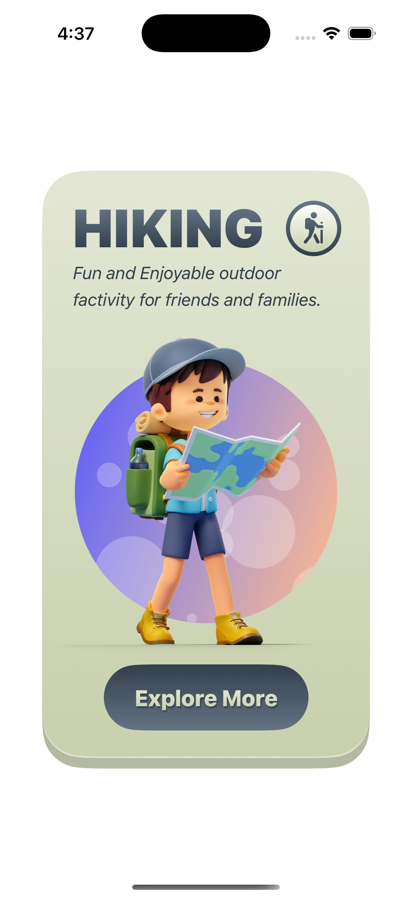
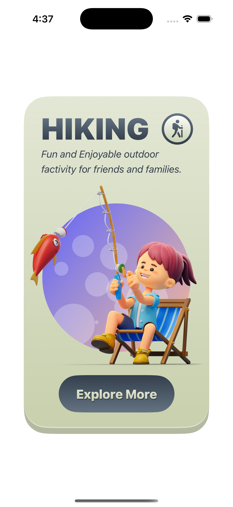
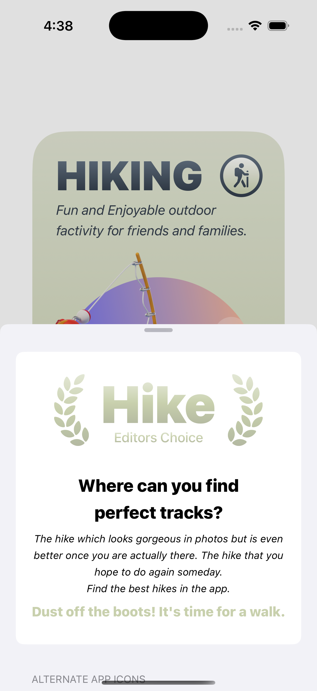
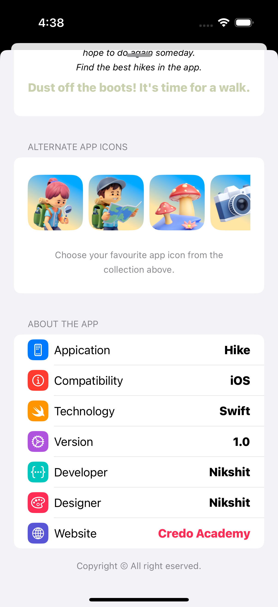

# HIKE - SwiftUI(iOS18)

HIKE showcases a variety of modern iOS 18 capabilities using SwiftUI, focusing on a polished user experience and clean architecture. Here are the main features:

## 🎨 1. Advanced UI with Custom Components
Custom SwiftUI views and reusable components are used to deliver a clean and elegant design. From adaptive layouts to reusable buttons, everything is designed to be visually appealing and scalable.

  

🧱 Modular code structure
🧩 Dynamic views tailored for iOS 18
📐 Consistent layout and styling across screens

## 🎞 2. Motion Animation for Enhanced Interaction
The app incorporates SwiftUI Motion APIs and transition effects to provide a delightful and responsive interface.

  

🌀 Smooth transitions between views
🔁 Animated progress indicators and view changes
💫 Natural motion to guide user focus

## 🖼 3. Image Animations with Subtle & Gorgeous Effects
Images are animated using SwiftUI’s built-in animation system, providing elegant fade-ins, scale, and slide transitions that make the app feel alive.

  

✨ Crossfade image transitions
🔍 Hover and tap effects (where applicable)
📸 Realistic movement mimicking native iOS feel

## 📄 4. Show Sheet for Professional UI Presentation
The app leverages SwiftUI’s .sheet modifier to present new views cleanly and professionally.

  
  

📥 Modal presentation of secondary content
🧭 Intuitive navigation and separation of content
📌 Mimics the behavior of system apps for familiarity

## 🧷 5. Install & Switch Custom App Icons
A built-in feature allows users to change the app icon from within the app, using UIApplication.shared.setAlternateIconName().

  

🎨 Multiple icon themes to match user preferences
⚙️ Easy access via settings screen
✅ Fully supported by iOS 18 and SwiftUI
